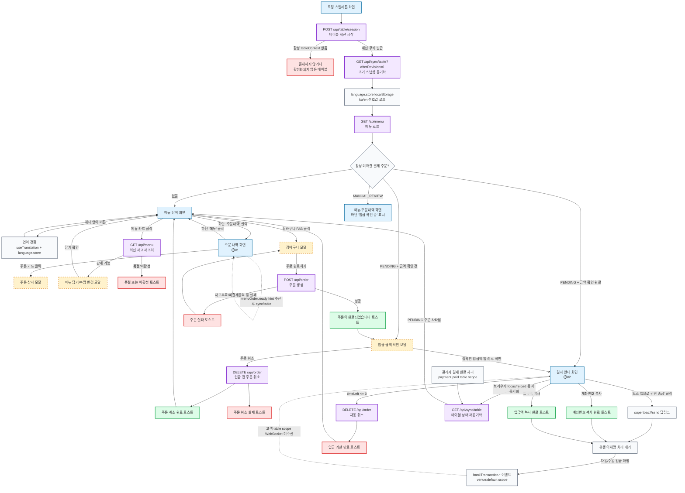
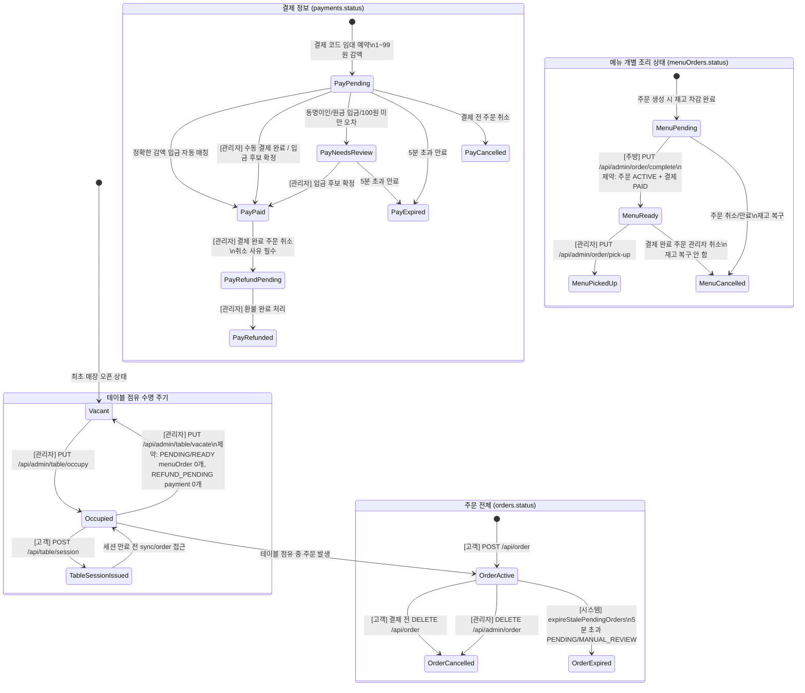
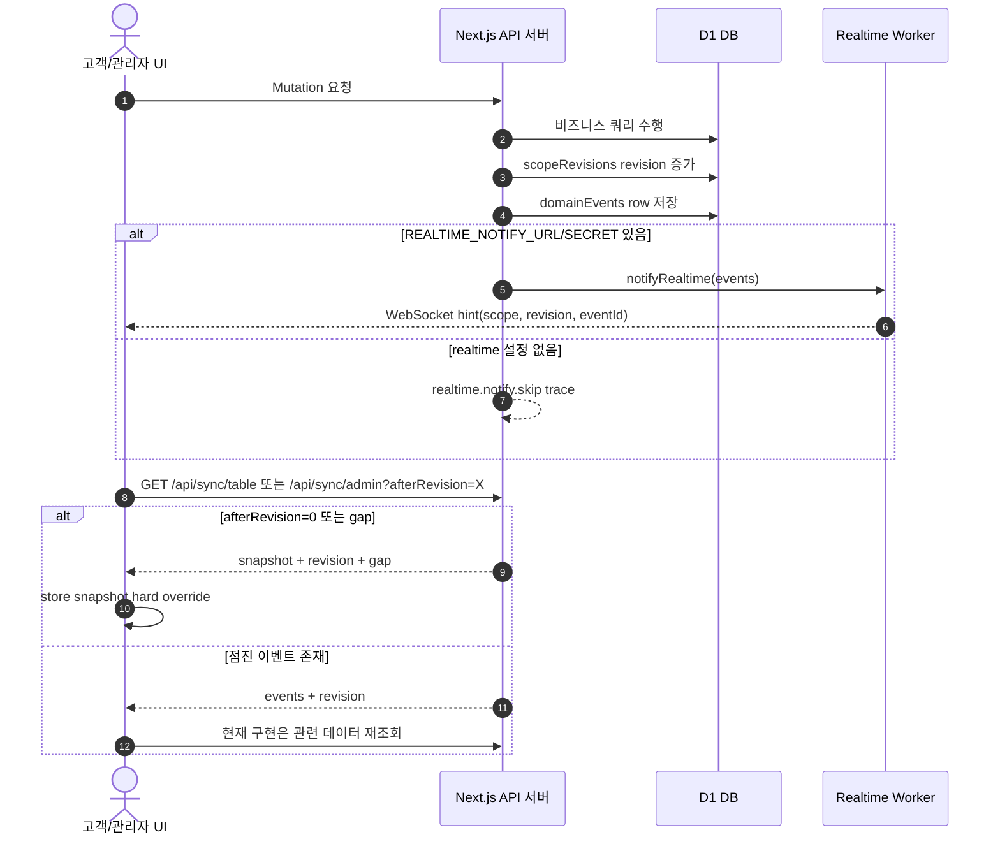
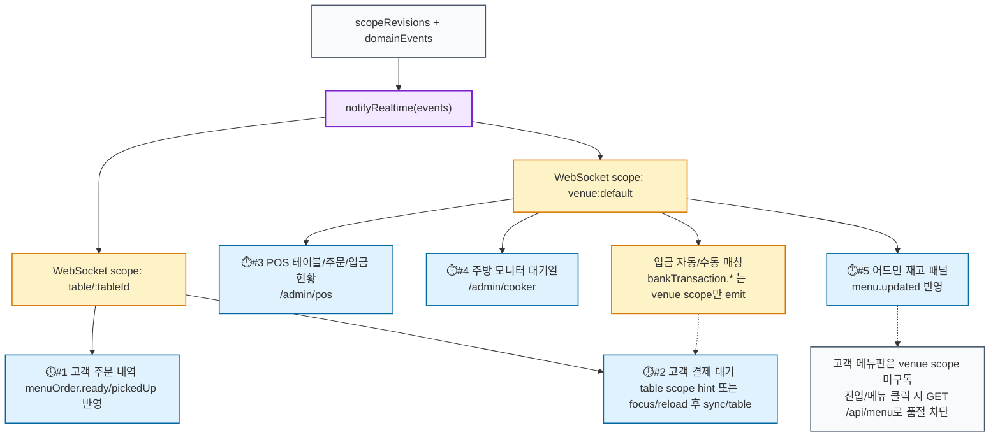
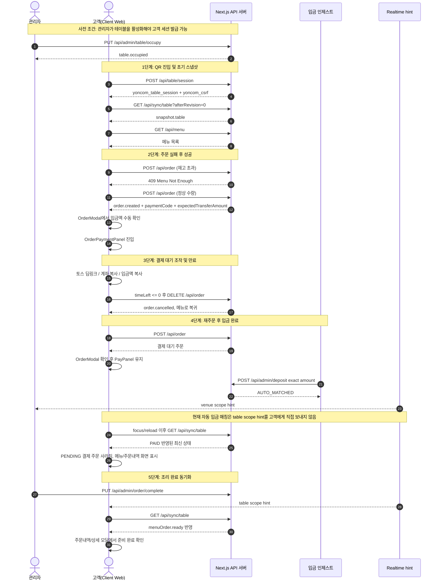
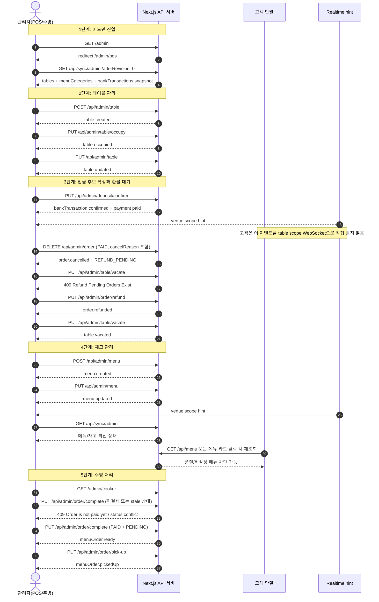

# yoncom-order 시스템 Mermaid 다이어그램 모음집

이 문서는 현재 `apps/next` 코드베이스 기준으로 연컴 오더(yoncom-order)의 **화면/모달 전환 흐름**, **데이터 상태 수명 주기**, **실시간 동기화 경계**, **최단 검증 시퀀스**를 정리한 Mermaid 소스 모음입니다. 고객 화면은 `useTranslation`과 `language.store`로 한국어/영어 런타임 전환을 지원하고, 메뉴/카테고리는 기본 한국어 필드와 선택 영문 필드를 함께 사용합니다.

공통 색상 규칙:

- 성공 토스트: 초록색
- 실패 토스트: 빨간색
- 로딩중 오버레이가 뜨는 API 호출: 보라색
- 모달: 노란색

---

## 1. 고객용 화면 및 모달 전환 흐름도 (Client-Side Transitions)

고객은 이미 관리자에 의해 활성화된 테이블 컨텍스트가 있는 QR URL(`/client/table/:id`)에 진입해야 합니다. QR 스캔 자체는 테이블 점유를 만들지 않고, `POST /api/table/session`은 활성 테이블 컨텍스트가 없으면 실패합니다.

---

## 2. 관리자용 화면 및 모달 전환 흐름도 (Admin-Side Transitions)

`/admin`은 독립 대시보드가 아니라 `/admin/pos`로 리다이렉트됩니다. POS에서 주방 화면(`/admin/cooker`)을 새 창으로 열 수 있고, 수동 입금 매칭은 별도 `ManualMatchModal`이 아니라 POS의 주문 현황 패널 내 “입금 확인 필요” 리스트에서 후보를 확정합니다. 재고 패널은 메뉴뿐 아니라 카테고리 관리와 한국어/영어 표시 메타데이터를 함께 관리합니다.

```mermaid
flowchart TD
    classDef page fill:#e0f2fe,stroke:#0369a1,stroke-width:1.5px;
    classDef modal fill:#fff2cc,stroke:#d97706,stroke-width:1.5px,stroke-dasharray:5 5;
    classDef loading fill:#f3e8ff,stroke:#7e22ce,stroke-width:2px;
    classDef error fill:#fee2e2,stroke:#dc2626,stroke-width:2px;
    classDef success fill:#dcfce7,stroke:#16a34a,stroke-width:2px;
    classDef panel fill:#f8fafc,stroke:#475569,stroke-width:1.5px;

    AdminEntry["/admin"]:::page -->|redirect| AdminPos["POS 운영 화면 /admin/pos<br/>⏱️#3"]:::page
    AdminPos -->|요리 섹션 버튼| AdminCooker["주방 모니터 /admin/cooker<br/>⏱️#4"]:::page
    AdminCooker -->|포스로 이동 버튼| AdminPos

    subgraph POS["POS 운영 화면"]
        OrdersPanel["주문 현황 패널 <Orders>"]:::panel
        TablesPanel["테이블 현황 패널 <Tables>"]:::panel
        InventoryPanel["재고 패널 <Inventories>"]:::panel
    end

    AdminPos --> OrdersPanel
    AdminPos --> TablesPanel
    AdminPos --> InventoryPanel

    TablesPanel -->|테이블 추가| TableCreate["테이블 생성 모달 <TableCreateModal>"]:::modal
    TableCreate --> CreateTableApi["POST /api/admin/table"]:::loading
    CreateTableApi --> CreateTableOk["테이블 생성 완료 토스트"]:::success
    CreateTableApi --> CreateTableFail["테이블 생성 실패 토스트"]:::error

    TablesPanel -->|테이블 카드 클릭| TableDetail["테이블 상세 모달 <TableDetailModal>"]:::modal
    TableDetail -->|활성화| OccupyApi["PUT /api/admin/table/occupy"]:::loading
    OccupyApi --> OccupyOk["테이블 점유 완료 토스트"]:::success
    OccupyApi --> OccupyFail["테이블 점유 실패 토스트"]:::error
    TableDetail -->|비활성화/퇴장 처리| VacateApi["PUT /api/admin/table/vacate"]:::loading
    VacateApi -->|미완료 주문/환불대기 존재| VacateFail["테이블 비우기 실패 토스트"]:::error
    VacateApi -->|성공| VacateOk["테이블 비우기 완료 토스트"]:::success
    TableDetail -->|정보 수정| UpdateTableApi["PUT /api/admin/table"]:::loading
    UpdateTableApi --> UpdateTableOk["테이블 수정 완료 토스트"]:::success
    UpdateTableApi --> UpdateTableFail["테이블 수정 실패 토스트"]:::error
    TableDetail -->|테이블 페이지| ClientTablePage["/client/table/:id 새 창"]:::page

    TablesPanel -->|테이블 제거| TableRemove["테이블 제거 모달 <RemoveTableModal>"]:::modal
    TableRemove --> RemoveTableApi["DELETE /api/admin/table"]:::loading
    RemoveTableApi --> RemoveTableOk["테이블 제거 완료 토스트"]:::success
    RemoveTableApi --> RemoveTableFail["점유 중이면 제거 실패"]:::error

    OrdersPanel -->|입금 확인 필요 후보 확정| ConfirmDepositApi["PUT /api/admin/deposit/confirm"]:::loading
    ConfirmDepositApi --> ConfirmDepositOk["입금 매칭 완료 토스트"]:::success
    ConfirmDepositApi --> ConfirmDepositFail["입금 매칭 실패 토스트"]:::error
    OrdersPanel -->|입금 내역 제외| IgnoreDepositApi["PUT /api/admin/deposit/ignore"]:::loading
    IgnoreDepositApi --> IgnoreDepositOk["입금 내역 제외 토스트"]:::success

    OrdersPanel -->|주문 카드 클릭| AdminOrderDetail["주문 상세 모달 <OrderDetailModal>"]:::modal
    AdminOrderDetail -->|관리자 결제 완료 처리| PayOrderApi["PUT /api/admin/order"]:::loading
    PayOrderApi --> PayOrderOk["관리자 결제 완료 토스트"]:::success
    PayOrderApi --> PayOrderFail["결제 처리 실패 토스트"]:::error
    AdminOrderDetail -->|주문 취소 / 취소 및 환불 대기 처리| CancelOrderApi["DELETE /api/admin/order"]:::loading
    CancelOrderApi --> CancelOrderOk["주문 취소 완료 토스트"]:::success
    CancelOrderApi --> CancelOrderFail["주문 취소 실패 토스트"]:::error
    AdminOrderDetail -->|READY 메뉴 수령 완료| PickUpApi["PUT /api/admin/order/pick-up"]:::loading
    PickUpApi --> PickUpOk["수령 완료 토스트"]:::success

    OrdersPanel -->|환불 필요 완료| RefundApi["PUT /api/admin/order/refund"]:::loading
    RefundApi --> RefundOk["환불 완료 토스트"]:::success
    RefundApi --> RefundFail["환불 실패 토스트"]:::error

    InventoryPanel -->|카테고리 관리| CategoryManage["카테고리 관리 모달 <CategoryManageModal><br/>ko/en 이름/설명"]:::modal
    CategoryManage --> CategoryManageApi["POST/PUT/DELETE /api/admin/menuCategory"]:::loading
    CategoryManageApi --> CategoryManageOk["카테고리 변경 완료 토스트"]:::success
    CategoryManageApi --> CategoryManageFail["카테고리 변경 실패 토스트"]:::error

    InventoryPanel -->|메뉴 추가| MenuCreate["메뉴 등록 모달 <MenuManageModal><br/>ko/en 이름/설명"]:::modal
    MenuCreate --> CreateMenuApi["POST /api/admin/menu"]:::loading
    CreateMenuApi --> CreateMenuOk["메뉴 생성 완료 토스트"]:::success
    CreateMenuApi --> CreateMenuFail["메뉴 생성 실패 토스트"]:::error
    InventoryPanel -->|메뉴 카드 클릭| MenuDetail["메뉴 수정 모달 <InventoryDetailModal><br/>ko/en 이름/설명"]:::modal
    MenuDetail --> UpdateMenuApi["PUT /api/admin/menu"]:::loading
    UpdateMenuApi --> UpdateMenuOk["메뉴 수정 완료 토스트"]:::success
    UpdateMenuApi --> UpdateMenuFail["메뉴 수정 실패 토스트"]:::error
    InventoryPanel -->|메뉴 제거| MenuRemove["메뉴 제거 모달 <InventoryRemoveModal>"]:::modal
    MenuRemove --> DeleteMenuApi["DELETE /api/admin/menu"]:::loading
    DeleteMenuApi --> DeleteMenuOk["메뉴 삭제 완료 토스트"]:::success
    DeleteMenuApi --> DeleteMenuFail["메뉴 삭제 실패 토스트"]:::error

    AdminCooker -->|메뉴 추가/제거| CookerMenuModal["모니터링 메뉴 선택 모달"]:::modal
    AdminCooker -->|조리 대기 카드 클릭| CookComplete["조리 완료 확인 모달 <MenuCompleteModal>"]:::modal
    CookComplete --> CompleteApi["PUT /api/admin/order/complete"]:::loading
    CompleteApi --> CompleteOk["준비 완료 토스트"]:::success
    CompleteApi --> CompleteFail["미결제/상태 경합 실패 토스트"]:::error
```

---

## 3. 데이터 무결성 상태 전이도 (State Transition Diagram)

백엔드 상태 머신은 테이블 컨텍스트, 주문, 결제, 메뉴 주문 상태가 분리되어 있습니다. 고객 QR 입장은 세션만 발급받으며, 현재 고객 페이지의 `table/session`은 활성 컨텍스트가 없으면 실패합니다. 운영 UI에서는 관리자가 먼저 테이블을 활성화해야 합니다.

메뉴/카테고리의 `nameEn`/`descriptionEn`은 주문 상태 전이가 아니라 렌더링 메타데이터입니다. 영어 값이 없으면 고객 화면은 기본 한국어 `name`/`description`을 fallback으로 사용합니다.

---

## 4. 실시간 동기화 아키텍처 및 5대 연동 맵 (Realtime Sync & Points)

서버는 mutation 성공 시 `scopeRevisions`와 `domainEvents`를 갱신하고, 설정된 `REALTIME_NOTIFY_URL`/`REALTIME_NOTIFY_SECRET`이 있을 때만 Realtime Worker에 hint를 보냅니다. 클라이언트는 WebSocket payload를 직접 reducer로 순차 적용하지 않고, hint를 받은 뒤 `sync/table` 또는 `sync/admin`을 호출합니다. snapshot이 있으면 store를 덮어쓰고, 점진 이벤트만 있으면 현재 구현은 관련 데이터를 재조회합니다.

### 1. 실시간 동기화 데이터 시퀀스

---

### 2. 매장 전체 동기화 포인트 맵

---

## 5. 최단 E2E 통합 테스트 시나리오 시퀀스

아래 시퀀스는 실제 코드 흐름에 맞춘 검증 순서입니다. 색상 규칙은 flowchart 다이어그램에 적용했고, sequence 다이어그램은 행위 순서와 API 경계 검증에 집중합니다.

### 1. 고객용 최단 통합 시퀀스

### 2. 관리자용 최단 통합 시퀀스

### 실시간 마킹 설명

- `⏱️#1`: 고객 주문 내역 화면. `menuOrder.ready`/`menuOrder.pickedUp` table scope hint 후 `sync/table`.
- `⏱️#2`: 고객 결제 대기 패널. `PUT /api/admin/order`의 `payment.paid`는 table scope hint를 만들지만, 자동/수동 입금 매칭의 `bankTransaction.*`은 현재 `venue:default`만 emit한다. 고객은 focus/reload 등으로 `sync/table`을 다시 호출하면 더 이상 `PENDING` 결제 주문이 아니어서 메인 UI로 복귀한다.
- `⏱️#3`: POS 운영 화면. `venue:default` hint 후 `sync/admin` 또는 refresh.
- `⏱️#4`: 주방 모니터. 결제 완료 주문이 `isKitchenOrder`가 되어 대기열에 등장.
- `⏱️#5`: 어드민 재고 패널. `menu.updated`는 `venue:default`로 반영된다. 고객 메뉴판은 현재 `venue:default`를 구독하지 않으므로 진입 시 또는 메뉴 카드 클릭 시 `GET /api/menu` 재조회로 품절을 차단한다.
